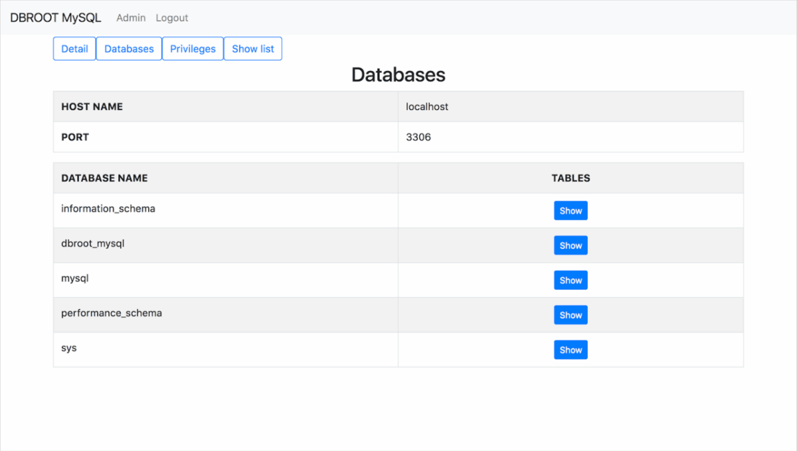

# DBROOT MySQL

DBROOT MySQL is simple web user interface for MySQL.

***DEMO:***

## Features

- Objects
 - show databases
 - show tables
 - show create table
 - show table status
- Privileges
 - mysql.user
 - mysql.db
 - mysql.tables_priv
- Show
 - show full processlist
 - show variables
 - show global status
 - show engine innodb status
 - show master status
 - show master logs
 - show slave status
 - show slave hosts

## Requirement

- Python 3.6
- Django 2.0
- MySQL 5.7

## Installation

### Step1. Create user and add grant on mysql.
    $ create user 'dbrootuser'@"{from_domain}" identified by "{password}";
    $ grant all privileges on *.* to 'dbrootuser'@"{from_domain}" identified by "{password}";

### Step2. Edit settings file for mysql connection.
    $ vi project/settings.py

### Step3. Edit consts file for oracle connection.
    $ vi app/consts.py

### Step4. Deployment
    $ git clone https://github.com/dbroot-mysql.git
    $ cd dbroot-mysql
    $ pip install -r requirements.txt
    $ python manage.py makemigrations app
    $ python manage.py migrate
    $ python manage.py createsuperuser
    $ python manage.py runserver 8000

## Author

[kiyomomo](https://github.com/kiyomomo)

## License

This software is released under the MIT License.
See [LICENSE](LICENSE) for more details.
